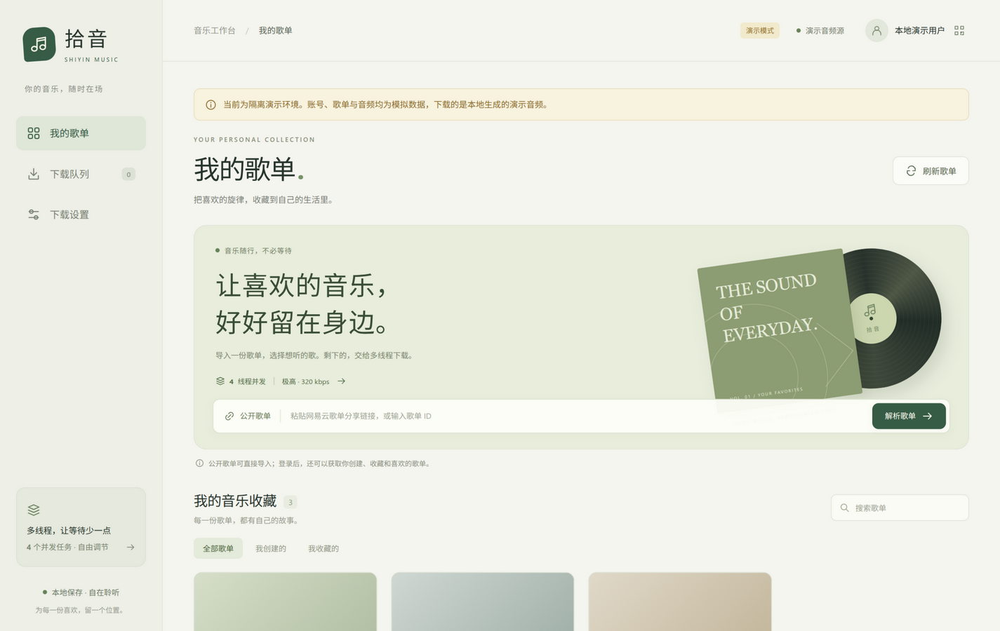

# Shiyin — a local playlist downloader

[中文](README.md) | English

A small, self-hosted Python tool with a local web UI for NetEase Cloud Music:
log in, browse your playlists, batch-download them with configurable concurrency,
quality and destination, and get lyrics (original + translation + romanization)
merged into both the audio tags and `.lrc` files. No build step, no cloud service.

It talks to a local NeteaseCloudMusicApi-compatible service on `127.0.0.1` — run one
with Docker or `npx`, or reuse the one bundled with an installed SPlayer.

**Docs**: [Development notes](DEVELOPMENT.md) (architecture, data flow, extension recipes,
design trade-offs) · [HTTP API reference](API_CONTRACT.md) · [Contributing](CONTRIBUTING.md) ·
[Security](SECURITY.md) · [中文](README.md)



## Features

- **Login**: QR code, SMS code, or pasting your own cookie.
- **Single track**: paste a song share link or id and download it directly — no playlist needed.
- **Your playlists**: all created and saved playlists (paged automatically), plus public
  playlists by link or id.
- **Batch download**: whole playlist or a selection, 1–12 songs at a time (default 4),
  with live progress, speed and an overall progress bar.
- **Quality & destination**: pick the download folder and the requested quality
  (standard / higher / exhigh / lossless / Hi-Res / jyeffect / sky / dolby / jymaster).
  Every task shows both the requested and the actually returned quality.
- **Lyrics**: original, translation and romanization merged within a 300 ms tolerance,
  embedded in the audio tags, optionally saved as a sidecar `.lrc`.
- **Queue control**: pause/resume, cancel one, retry failed, clear finished, export a report.
- **Safe writes**: downloads go to a temporary file first and are committed only after
  size/md5 checks; existing files are skipped and never overwritten.
- **Security**: loopback-only binding, CSRF token on every write, cookie stored in a
  `0600` file and never in browser storage.

## Requirements

- **Python 3.10+**
- **A local NeteaseCloudMusicApi-compatible service** listening on `127.0.0.1`, one of:
  1. **Docker** (no Node needed): `docker run -d -p 3000:3000 moefurina/ncm-api:latest`,
     then set the API address to `http://127.0.0.1:3000`.
  2. **npx** (needs Node.js):
     `ENABLE_GENERAL_UNBLOCK=false HOST=127.0.0.1 PORT=3000 npx -y @neteasecloudmusicapienhanced/api@4.34.3`
  3. **An installed SPlayer**: it serves the API while running; use
     `http://127.0.0.1:25884/api/netease` (the default).
- The standalone service exposes routes at the **root**, SPlayer behind `/api/netease`.
- The service ships a third-party source unlocker enabled by default
  (`ENABLE_GENERAL_UNBLOCK=true`). This project uses official endpoints only; set it to `false`.
- Only loopback API addresses are accepted; remote hosts are rejected on purpose.
- Optional: `ffmpeg` (needed for tests and `--demo`), `zenity`/`kdialog` (Linux folder
  picker — Windows uses the native dialog), `qrcode` (demo QR image only).

## Quick start

```bash
git clone https://github.com/w-sli/netease-music-downloader.git
cd netease-music-downloader
./run.sh                       # Linux / macOS
```

Windows (PowerShell, or double-click `run.bat`):

```powershell
powershell -ExecutionPolicy Bypass -File run.ps1
```

Manual setup:

```bash
python3 -m venv .venv
.venv/bin/pip install -r requirements.txt
.venv/bin/python app.py
```

Then open <http://127.0.0.1:36523>.

| Flag | Meaning |
| --- | --- |
| `--port 36523` | Web UI port |
| `--data-dir DIR` | Settings/session folder (default `~/.config/shiyin-downloader`, Windows `%APPDATA%\shiyin-downloader`) |
| `--demo` | Offline demo: fake account and 5-second test audio, no real API or downloads |
| `--no-browser` | Do not open a browser |

## Notes on quality

The selected quality is what is *requested*; what you actually get depends on your account
entitlements and the track itself. Each task lists both, and a track that only yields a
preview clip fails loudly instead of being saved as a half song.

## Tests

```bash
python -m pytest tests/ -q     # requires ffmpeg
```

No network access is required: audio fixtures are generated locally with ffmpeg and the
download tests run against a local HTTP server on `127.0.0.1`.

## AI-assisted development

Parts of this project's code, tests and documentation were drafted with an AI coding
assistant (ZCode CLI agent); the author defined the requirements, made the design
decisions, reviewed every change and signed off before committing.

Although all AI-generated content was reviewed and tested, it may still contain bugs,
outdated statements or security weaknesses. Do not rely on it for high-stakes or
compliance-sensitive use; no warranty is provided.

Verify the behaviour yourself with `python -m pytest tests/ -q` (needs ffmpeg) or the
offline demo `python app.py --demo`.

## Disclaimer & license

- Not affiliated with NetEase Cloud Music or with the SPlayer project.
- Provides no music content, bypasses no DRM, and bundles no third-party source unlocker.
- Use it only to back up content your own account is entitled to, and follow your local
  laws and the relevant terms of service.
- Licensed under **MIT** (see `LICENSE`); third-party notices in `THIRD_PARTY_NOTICES.md`.
