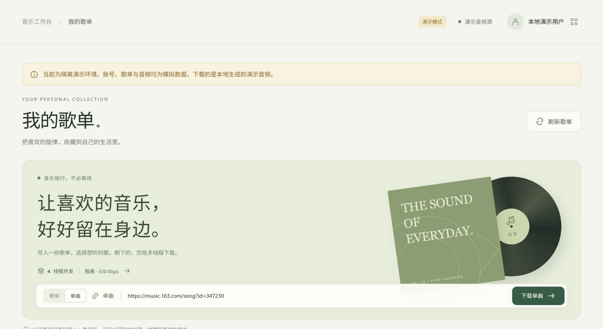
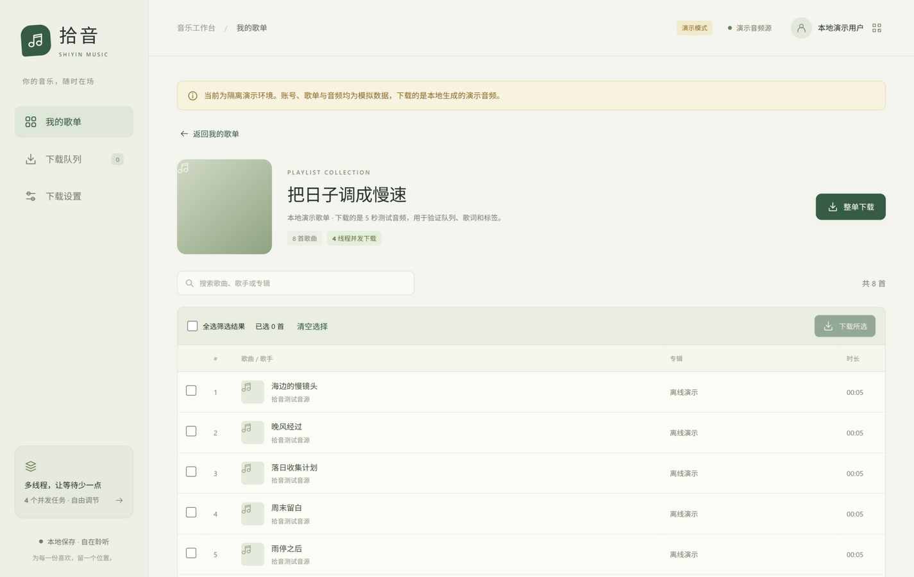
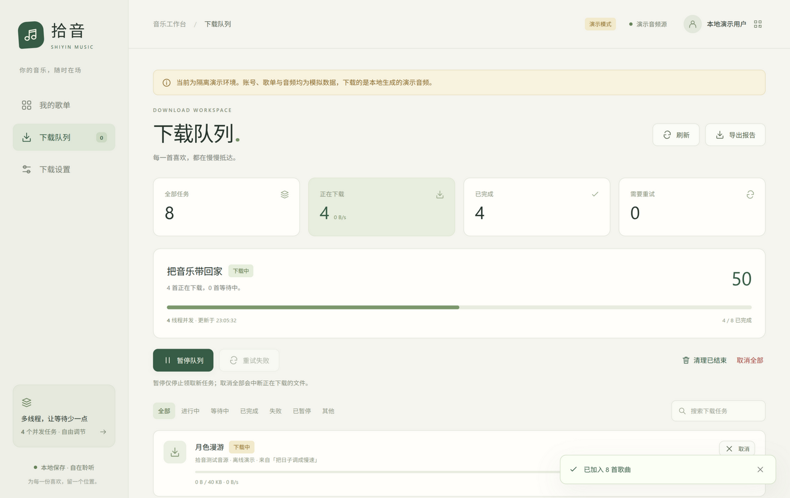

# 拾音 · 本地歌单下载器

> A local playlist downloader for NetEase Cloud Music: log in, browse your playlists,
> batch-download them with configurable concurrency, quality and destination, and get
> merged lyrics (original + translation + romanization) written into both the audio
> tags and `.lrc` files. Python + a small local web UI, no build step.

[中文](README.md) | [English](README.en.md)

一个独立的 Python + 网页小工具：登录网易云音乐账号，查看个人歌单，**多线程批量下载**到本地，
可设置下载目录与音质，并把歌词（原文、翻译、罗马音）合并后写进音频标签和同名 `.lrc` 文件。

它只需要一个兼容 NeteaseCloudMusicApi 约定的本机接口服务——自己用 Docker 或 `npx` 起一个，
或者复用你本机已安装的 SPlayer 内置服务，三种方式任选。

**文档**：[开发说明](DEVELOPMENT.md)（架构/数据流/扩展步骤/设计取舍） ·
[接口参考](API_CONTRACT.md) · [贡献指南](CONTRIBUTING.md) · [安全说明](SECURITY.md) · [English](README.en.md)


## 功能

- **登录**：扫码登录、手机验证码登录、手动粘贴 Cookie 三种方式。
- **单曲下载**：不用先找歌单，粘贴单曲分享链接或歌曲 ID 就能直接下载一首（多首用逗号分隔也行）。
- **个人歌单**：读取你创建和收藏的全部歌单（自动分页），也可以直接粘贴公开歌单链接或歌单 ID。
- **批量多线程下载**：整单下载或勾选部分歌曲，可同时下载 1–12 首（默认 4），实时显示进度、速度与总体进度。
- **下载地址与音质**：可设置下载目录和音质（标准 / 较高 / 极高 / 无损 / Hi-Res / 高清臻音 / 沉浸环绕 / 杜比全景声 / 超清母带），每首歌曲同时显示“请求音质”和接口实际返回的音质。
- **歌词处理**：原文、翻译、罗马音按 300 毫秒容差合并（最近优先一对一匹配），写入音频内嵌歌词，并可另存同名 `.lrc`。
- **队列控制**：暂停 / 恢复、取消单首、失败重试、清理已结束任务、导出下载报告。
- **可靠落盘**：先写临时文件，校验大小与完整性后才落盘；已有文件默认跳过，任何情况下都不会覆盖。
- **安全**：只监听本机、写操作带 CSRF 校验、Cookie 保存在权限 600 的文件中且不写入浏览器存储。

## 环境要求

- **Python 3.10 以上**
- **一个本机可用的网易云音乐接口服务**（监听 `127.0.0.1`），三种方式任选其一：
  1. **Docker（没有 Node 时推荐）**
     ```bash
     docker run -d -p 3000:3000 --name ncm-api moefurina/ncm-api:latest
     ```
     接口地址填 `http://127.0.0.1:3000`。（镜像与版本号请以该项目文档为准。）
  2. **npx（需要 Node.js）**
     ```bash
     ENABLE_GENERAL_UNBLOCK=false HOST=127.0.0.1 PORT=3000 \
       npx -y @neteasecloudmusicapienhanced/api@4.34.3
     ```
     接口地址填 `http://127.0.0.1:3000`。本项目在 Node v20.20.2 上实测可用；
     该服务 README 建议 Node 22 及以上，版本过旧请先升级 Node。
  3. **复用已安装的 SPlayer**：SPlayer 运行时会自带该服务，接口地址填
     `http://127.0.0.1:25884/api/netease`（这是默认值，开箱即用）。
- 路径区别：独立服务的接口在**根路径**，SPlayer 的带 `/api/netease` 前缀；填错会提示“返回了非 JSON 内容”。
- 该服务默认启用第三方音源解锁（`ENABLE_GENERAL_UNBLOCK=true`）。本项目只使用官方接口，
  建议启动时设为 `false`（见上面的命令）。
- 出于安全考虑，接口地址仅允许本机回环地址（`127.0.0.1` / `localhost` / `::1`），不支持指向远程服务。
- 可选：`ffmpeg`（**测试与演示模式都需要**）、`zenity` 或 `kdialog`（Linux 的“选择目录”按钮；
  Windows 自动改用系统对话框）、`qrcode`（仅演示模式显示二维码图片，缺省时显示占位提示而不报错）。

## 快速开始

```bash
git clone https://github.com/w-sli/netease-music-downloader.git
cd netease-music-downloader
./run.sh                       # Linux / macOS：自动建环境、装依赖并打开浏览器
```

Windows（PowerShell 或双击 `run.bat`）：

```powershell
powershell -ExecutionPolicy Bypass -File run.ps1
```

也可以手动运行：

```bash
python3 -m venv .venv
.venv/bin/pip install -r requirements.txt
.venv/bin/python app.py
```

打开 <http://127.0.0.1:36523> 即可。常用参数：

| 参数 | 说明 |
| --- | --- |
| `--port 36523` | 指定网页端口 |
| `--data-dir 目录` | 指定配置与会话目录（默认 Linux `~/.config/shiyin-downloader`，Windows `%APPDATA%\shiyin-downloader`） |
| `--demo` | 离线演示模式：本地模拟账号和 5 秒测试音频，不连接真实接口、不下载真实歌曲（数据目录默认位于系统缓存目录，需要 ffmpeg） |
| `--no-browser` | 不自动打开浏览器 |

## 使用流程

1. **登录是可选的**：不登录也能用——公开歌单可以直接导入，**免费单曲也能直接下载**；
   登录之后才能看到「我的歌单」，并且能下载收费曲、拿到更高的音质档位。
   要登录就点右上角**登录账号**，扫码 / 短信 / Cookie 任选一种（扫码是两步：扫码后还要在手机上点确认）。
2. 在**我的歌单**里点开一个歌单，勾选歌曲后点“下载所选”，或直接点“整单下载”；
   只想下一首时，把上方的模式切到**单曲**，粘贴分享链接或歌曲 ID 点“下载单曲”即可。
3. 到**下载队列**看进度，可暂停、取消、重试或导出报告。
4. 在**下载设置**里调整下载目录、音质、并发线程数、歌词与封面选项。设置保存后立即对**新任务**生效；
   重试失败任务时会采用当前设置（例如新开启的后备地址选项）。并发数调小只影响之后领取的任务，
   已经在下载的会继续跑完。

**没登录时会遇到的情况**（都属于预期，不是故障）：

| 现象 | 原因 |
| --- | --- |
| 收费曲提示“没有可用下载地址：可能需要登录、会员，或歌曲已下架” | 官方下载接口对收费曲要求账号 |
| 请求无损却拿到 320k mp3 | 匿名没有无损权限，接口自动降到最高可用；队列里「实际音质」会如实显示 |
| 会员曲提示“只返回试听片段” | 工具不会把半首歌当完整歌曲保存 |
| 「我的歌单」为空并提示需要登录 | 个人歌单接口要求账号 |

如果不想登录又想下更多歌，可以打开「播放地址后备」——它改用在线播放地址，
免费曲基本都能拿到，但音质同样受匿名档位限制，会员曲仍然只给试听片段。

## 关于音质

界面里的音质是**向接口请求的音质**，能不能真的拿到取决于你的账号权限与音源本身。
每首任务都会显示接口实际返回的音质，两者不一致时会同时列出，不会假装下载到了无损。

如果接口只返回试听片段，任务会直接失败并提示“只返回试听片段”，**不会**把半首歌当成完整歌曲保存。

## 文件命名与已有检查

```
歌名 - 歌手.mp3          例：海边的慢镜头 - 某歌手.mp3
歌名 - 歌手.lrc          与音频同名，仅在开启“保存 LRC 歌词文件”时生成
歌单名 [歌单ID]/          仅在开启“按歌单建立文件夹”时作为子目录
```

**单曲下载**没有歌单可归，即使开启了「按歌单建立文件夹」也直接落在下载目录根下，重试时同样如此，
不会因为重试而跑进某个子目录。

歌名、歌手与歌单名里的 `\ / : * ? " < > |` 和控制字符会替换成 `_`，去掉首尾空格与点，
并按长度截断（歌名 45、歌手 35、歌单 65 字符）；`CON`、`COM1`、`NUL.mp3` 这类 Windows 保留名会加下划线前缀。
名称比较在 Windows 上不区分大小写，因此“Song - A”与“song - a”会被正确视为同一文件。

**同名歌曲**（同一目录里歌名与歌手都相同）会各自带上歌曲 ID 区分，例如 `同一首歌 - 同一位歌手 [1001].mp3`，
避免后下载的那首被当成“已存在”而丢掉。

**已有检查分两层**：入队时按“目录 + 歌曲 + 音质”比对队列记录（文件仍存在才算），
真正下载前再检查一次目标文件，已存在就跳过并说明原因。失败和已取消的任务不会挡住重新入队，
所以改完设置（比如打开后备地址）可以直接再下一次。

跳过时会明确区分两种情况：文件是本工具的下载记录（“保留原文件；未验证其内容”），
还是你手动放进来的同名文件（“不是本工具的下载记录，已跳过以免覆盖”）。下载前的检查遇到零字节文件会直接报错，
让你先移走它（入队层只看文件是否存在，不区分大小）。

落盘使用**硬链接**提交，因此即使有同名文件在检查之后才出现也不会被覆盖；文件系统不支持硬链接时
（exFAT、部分网络盘）会自动退化为**独占创建**再拷贝，仍不会覆盖任何已有文件。
接口未提供文件大小时，任务会完成但带上“无法校验完整性”的提示，不会假装校验过。

因为文件名不含音质，**切换音质后重新下载同一首歌会跳过而不是另存一份**；想保留两个音质版本，请先移走旧文件或改名。

## 界面

歌单库与导入（模式可切换为「单曲」，粘贴单曲链接直接下载）：


单曲模式：



歌单详情（勾选歌曲或整单下载）：



下载队列（8 个任务、4 个并发进行中、总体 50%；截图为演示模式的 40 KB 测试音频，
真实歌曲会显示渐变进度与实时速度）：



- 左侧导航：我的歌单 / 下载队列 / 下载设置；窄屏自动变成底部导航。
- 歌单页：封面网格、搜索、我创建的 / 我收藏的筛选、公开歌单导入。
- 队列页：总体进度、状态筛选、单曲进度条与速度、失败原因、重试与取消。
- 设置页：目录、音质、并发、重试次数、歌词翻译/罗马音、内嵌歌词、独立 LRC、封面、按歌单建文件夹、接口地址、播放地址后备。

## Windows / 双系统

- 用 `run.ps1`（或双击 `run.bat`）启动；手动命令是 `.venv\Scripts\python -m pip install -r requirements.txt`
  与 `.venv\Scripts\python app.py`。
- 界面里的「选择目录」在 Windows 上走系统对话框，不需要 zenity/kdialog。
- 下载目录请填绝对路径（例如 `D:\Music\shiyin`），建议避开 OneDrive 等同步目录。
- **不要让两个系统共用同一个 `.venv`**：Linux 是 `.venv/bin/`，Windows 是 `.venv/Scripts/`，混用会产生损坏的虚拟环境。
  在哪个系统跑就在哪个系统建一次（或分别用 `.venv-linux` / `.venv-win`）。
- 顺便提醒：`--data-dir` 也不建议放在共享分区，两个系统各用各的用户目录更省心。
- 换行符已由 `.gitattributes` 统一（`.sh` 用 LF，`.bat`/`.ps1` 用 CRLF），跨系统编辑不会产生整文件差异。
- 测试与演示模式需要 `ffmpeg`：`winget install Gyan.FFmpeg` 或 `choco install ffmpeg`，装完确认 `ffmpeg -version` 可用。

## 常见问题

- **提示“无法连接音乐接口”**：确认接口服务已在 `127.0.0.1` 上运行，且接口地址前缀正确
  （独立服务用根路径，SPlayer 用 `/api/netease`）。本项目刻意不使用系统代理，所以“开了代理反而连不上”是预期行为。
- **提示“已中止，以免把账号凭据转发到其它主机”**：接口服务返回了重定向。请检查 `api_base` 是否写错；
  本项目不会跟随重定向，因为这个请求带着你的账号 Cookie。
- **端口被占用**：换一个端口，例如 `--port 36524`；Linux 用 `ss -ltnp | grep 36523`，Windows 用 `netstat -ano | findstr 36523` 查看占用。
- **登录失效**：接口返回 301/302 时界面会提示重新登录；也可以删掉数据目录里的 `session.json` 后重新扫码。
- **只拿到试听片段**：通常是账号没有该音质权限或歌曲已下架，可降低音质后重试。
- **文件被跳过**：看任务上的提示文字区分“本工具已下载过”与“存在外部同名文件”；切音质不会另存一份。
- **杀软/防火墙**：服务只绑定 `127.0.0.1`，不需要放行入站；个别杀软会拦临时文件与硬链接，可把下载目录加入白名单。

## 项目结构

| 文件 | 作用 |
| --- | --- |
| `app.py` | Flask 服务与全部接口路由，启动入口 |
| `core.py` | 设置存取与校验、会话 Cookie、网易云接口调用、歌单分页、下载地址解析 |
| `downloader.py` | 多线程下载队列：并发调度、重试、取消、进度、原子落盘 |
| `lyrics.py` | 歌词合并与音频标签写入（MP3 / FLAC / M4A / OGG / Opus） |
| `demo.py` | 离线演示模式的模拟账号与本地测试音频 |
| `templates/index.html`、`static/app.css`、`static/app.js` | 网页界面（原生 HTML/CSS/JS，无打包步骤） |
| `run.sh`、`run.ps1`、`run.bat` | 一键启动脚本（Linux/macOS、Windows） |
| `requirements.txt`、`requirements-dev.txt` | 运行与开发依赖 |
| `tests/` | `test_lyrics.py`（歌词与标签）、`test_downloader.py`（队列与落盘）、`test_core.py`（设置与接口客户端） |
| `DEVELOPMENT.md` | **开发说明：架构、数据流、状态机、扩展步骤、设计取舍** |
| `API_CONTRACT.md` | HTTP 接口参考（请求/响应、错误约定、队列操作语义） |
| `LICENSE`、`THIRD_PARTY_NOTICES.md` | 许可与第三方说明（含与 SPlayer 的关系说明） |
| `docs/` | README 使用的界面截图 |

## 二次开发

想改代码请先读 **[DEVELOPMENT.md](DEVELOPMENT.md)**，里面有：

- 模块划分与依赖方向、一次下载的完整数据流与线程模型；
- **「为什么这么设计」的取舍表**（接口参数为何走查询串、为何不跟随重定向、为何用硬链接提交、
  取消/重试的所有权令牌、大小写不敏感的路径比较、并发上限为何与线程池绑定）。
  这些地方改错的后果通常是「静默下错歌」或「覆盖文件」，比编译错误更难发现；
- 数据格式：数据目录、`settings.json` 字段、任务记录字段与状态机；
- 常见改动的操作清单（加接口 / 加音质 / 加设置项 / 加界面视图 / 换接口服务 / 支持新音频格式）；
- 测试的三条硬规矩（不得联网、改行为就补测试、如何用 mock 覆盖 `os.link` 这类分支）；
- 已知限制与非目标、按症状排查的对照表。

接口细节见 [API_CONTRACT.md](API_CONTRACT.md)，参与贡献见 [CONTRIBUTING.md](CONTRIBUTING.md)。

## 测试

```bash
python -m pytest tests/ -q     # 需要 ffmpeg 生成音频样本
python app.py --demo           # 演示模式，用来验证登录之外的完整交互
```

测试**不访问外网**：歌词与标签测试用本机 ffmpeg 生成样本音频，
下载测试用 `127.0.0.1` 上的本地 HTTP 夹具，因此在 CI 中可稳定运行。

## 实现说明

下载流程沿用 NeteaseCloudMusicApi 的接口约定（SPlayer 使用的是同一套约定）：

- 下载地址优先用 `/song/download/url/v1`（音质与账号权限对应）；失败时可选回退，
  非杜比音质走 `/song/url/v1`，杜比走 `/song/url`（`br=999000&immerseType=c51`）。
- 所有接口参数都通过 **URL 查询参数**传递。该接口服务会忽略 JSON 请求体，只按 URL（含参数）区分请求与缓存，
  用请求体会导致不同歌曲命中同一缓存、返回同一个地址。
- 接口请求**不跟随重定向**：请求头里带着账号 Cookie，跟随跳转可能把它发到其它主机。
- 音频下载使用自有 UA（`Shiyin/1.0`）并禁用系统代理；Cookie 只发给本机接口，永远不发给音频 CDN。
- 歌词合并的匹配规则是本项目自己的实现：在 300 毫秒容差内枚举候选对，按“时间差最近优先”一对一配对，
  再输出为同时间戳的多行 LRC，写入 `USLT`（MP3）、`lyrics`（FLAC/OGG/Opus）、`©lyr`（M4A）等标签字段。
  **这与 SPlayer 的顺序双指针贪心不同**，边界情形下结果会不一样（例如原文时间 `[0, 200]`、译文 `[150]`，
  本项目把译文配给更近的 200）。差异与许可说明见 `THIRD_PARTY_NOTICES.md`。
- 与 SPlayer 的实现取舍不同之处：**歌曲级并发**（而不是固定单首），并校验 `Content-Length`、文件大小与 MD5。

## AI 辅助开发声明

本项目的代码、测试与文档在开发过程中使用了 **AI 编码助手（ZCode CLI agent）** 辅助起草和修改；
需求定义、方案取舍、逐段复核与最终验收由作者负责。

具体而言：Flask 路由、下载队列与落盘逻辑、歌词合并、前端交互、单元测试，以及 README 和第三方说明等文档，
都是 AI 依据作者的要求生成初稿，再由作者审阅、修改并跑通测试后提交。

所有 AI 生成内容都经过人工复核，但**仍可能包含错误、过时描述或安全隐患**；请不要把它用于高风险或
合规敏感的场景，作者不对使用后果作出任何担保。

你可以自行验证实际行为：运行 `python -m pytest tests/ -q`（需 ffmpeg），
或运行 `python app.py --demo` 在离线演示模式下走一遍完整交互。

发现问题的欢迎提 Issue。本项目不保证与任何第三方服务或软件的行为一致。

## 免责声明与许可

- 本项目与网易云音乐及其关联公司**无任何关联**，与 [SPlayer](https://github.com/SPlayer-Dev/SPlayer) 项目及其作者也无隶属或背书关系。
- 本项目**不提供任何音乐内容**，不绕过任何数字版权管理措施，也不内置任何第三方音源解锁功能。
- 请仅用于**个人合法备份**你自己账号有权访问的内容，并遵守当地法律与相关服务条款。请尊重音乐版权。
- 本项目以 **MIT 许可**发布，见 `LICENSE`；第三方项目说明见 `THIRD_PARTY_NOTICES.md`。
